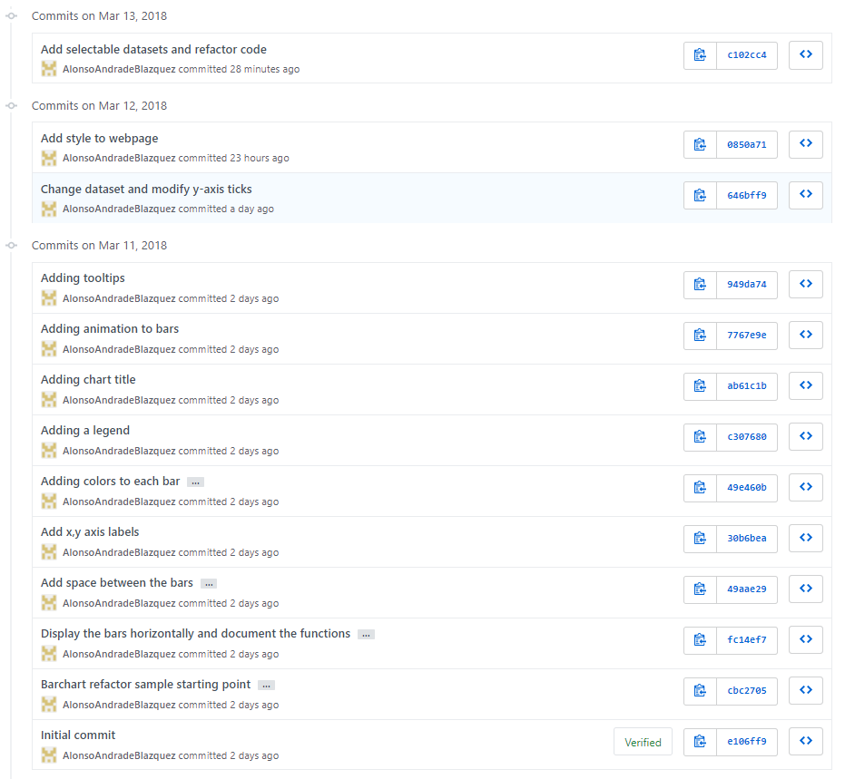
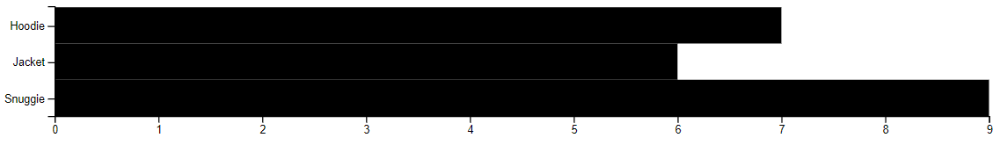
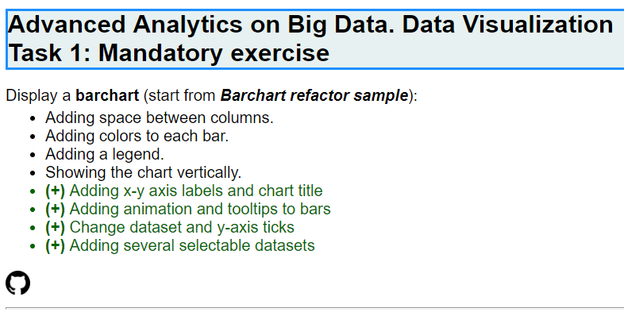
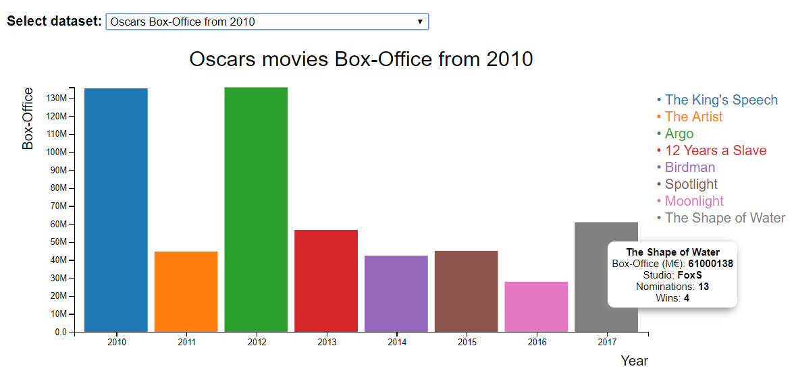
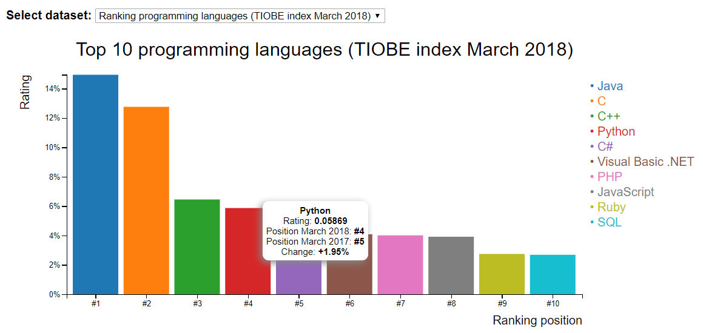

# D3js_MandatoryTask_MasterBigData
First task for Data Visualization module from master "Advanced Analytics on Big Data".

This task consists on displaying a barchart (starting from "Barchart refactor sample" from Lemoncode github), with the following features:
- Adding space between columns.
- Adding colors to each bar.
- Adding a legend.
- Showing the chart vertically.

Additionally, more features were included, just for learning:
- Adding x-y axis labels and chart title
- Adding animation and tooltips to bars
- Change dataset and y-axis ticks
- Adding several selectable datasets

Below there is an explanation on how to run the example and how it was developed.

## Usage
Please follow these steps to visualize the exercise:
1. Move to any desired folder: ``cd <path>``.
2. Clone there git repository: ``git clone https://github.com/AAB87/D3js_MandatoryTask_MasterBigData.git``.
3. Move to folder "D3js_MandatoryTask_MasterBigData": ``cd D3js_MandatoryTask_MasterBigData``
4. Open ``index.html`` in your favourite browser.

## Steps followed
The code updated in the different steps for this exercise is reflected in the different commits in github:



### Starting point: Bar chart refactor sample
In this step code from Lemoncode repository is obtained. This sample shows x-y axis and horizontal black-coloured bars:


We took this source code as a reference for developing the exercise. Below there is an explanation of the changes in each commit:

### Display the bars vertically
For performing this change, the ordinal values (products in the dataset) should be now considered for x-axis for the mapping svg-domain:
```diff
function setupXScale() {
-  var maxSales = d3.max(totalSales, function(d, i) {
-    return d.sales;
-  });
-
-  x = d3.scaleLinear()
-    .range([0, width])
-    .domain([0, maxSales]);

+  x = d3.scaleBand()
+        .rangeRound([0, width])
+        .domain(totalSales.map(function(d) {
+          return d.product;
+        }));
 }
```

For the correct y-axis scale setting, mapping should be: canvas range (height..0) = (chart bottom..chart top) to data = domain (0...maxSales):
```diff
function setupYScale() {
-  y = d3.scaleBand()
-    .rangeRound([0, height])
-    .domain(totalSales.map(function(d, i) {
-      return d.product;

+    var maxSales = d3.max(totalSales, function(d) {
+      return d.sales;
+    });
+    
+    y = d3.scaleLinear()
+      .range([height, 0])
+      .domain([0, maxSales]);
 }
```

For appending bar charts, we also have to change ``x``, ``y``, ``width`` and ``height`` attributes in ``appendChartBars`` function:
- ``x`` is now ``product`` and ``y`` is ``sales``:
```diff
-      .attr('x', x(0))
-      .attr('y', function(d, i) {
-        return y(d.product);
-      })
-      .attr('height', y.bandwidth)
-      .attr('width', function(d, i) {
-        return x(d.sales);
-      });
+              .attr('x', function(d) {
+                return x(d.product);
+              })
+        
+              .attr('y', function(d) {
+                return y(d.sales);
+              })   
```
- ``width`` is set now as the bandwidth (divided per the number of values in the ordinal scale); and ``height`` is ``svg`` height minus ``y(data.sales)`` height value, to define the top of each bar:
```diff
-      .attr('height', y.bandwidth)
-      .attr('width', function(d, i) {
-        return x(d.sales);
-      });
+              .attr('width', function() {
+                return x.bandwidth();
+              })
+        
+              .attr('height', function(d) {
+                return height - y(d.sales);
+              })
```
### Adding space between the bars
This change is as easy as adding a ``padding`` to x-scale in function ``setupXScale``, expressed in percentage of the bandwidth:
```diff
 function setupXScale() {
   x = d3.scaleBand()
         .rangeRound([0, width])
+        .padding(0.1)
         .domain(totalSales.map(function(d) {
           return d.product;
         }));
``` 
### Adding x-y labels and chart title
For this purpose, we append texts to the ``svg``, positioned in x-y using the previously defined ``width`` and ``height`` variables. Once positioned, ``text-anchor`` fixes the justification in that position and ``text`` is used for the label text. We included **``class`` attributes** because, as we will see later, they will be used for **removing the labels when we change the dataset**.
```diff
+function appendXLabel() {
+  svg.append("text")
+    .attr("class", "x label")
+    .attr("x", width)
+    .attr("y", height + 40)
+    .attr("text-anchor", "end")
+    .text("Product");
+}

+function appendYLabel() {
+  svg.append("text")
+    .attr("class", "y label")
+    .attr("x", 0)
+    .attr("y", -30)
+    .attr("text-anchor", "end")
+    .attr("transform", "rotate(-90)")
+    .text("Sales");
+}

+function appendChartTitle() {
+  svg.append("text")
+      .attr("x", (width / 2))             
+      .attr("y", 0 - (margin.top / 2))
+      .attr("text-anchor", "middle")  
+      .style("font-size", "16px") 
+      .style("text-decoration", "bold")  
+      .text("Product sales");
+}
```
### Adding colors to each bar
For this purpose, firstly we set variable barColor within ``appendChartBars`` with a color scale for ordinal values available in ``d3``:
```diff
+  barColor = d3.scaleOrdinal(d3.schemeCategory10);
```
Additionally, we add a ``fill`` attribute, with a funtion that returns a color from the scale for each product:
```diff
+
+              .attr('fill', function(d) {
+                return barColor(d.product);
+              });
```
### Adding a legend
Here we add a new function (``appendLegend``) which append a text for each product in the data, with the attributes ``text``, ``fill`` for the color (here we use the same variable ``barColor`` to match each legend color with its bar) and ``x``, ``y`` for the positioning
```diff
+function appendLegend() {
+  svg.append('g')
+      .attr('class', 'legend')
+      .selectAll('text')
+      .data(totalSales)
+      .enter()
+      .append('text')
+      
+      .text(function(d) {
+        return '• ' + d.product; 
+      })
+      
+      .attr('fill', function(d) { 
+        return barColor(d.product); 
+      })
+
+      .attr('x', width + 10)
+
+      .attr('y', function(d, i) {
+        return 20 * i; 
+      });
+  }
```
### Adding animation to bars
Here we can use ``transition`` and ``duration`` methods within ``appendChartBars`` function for adding rising bar animations, but **we must be careful with their position within the code**. The sequence must be:
- Set ``x``, ``width`` attributes
- Set initial ``y`` attribute as ``y(0)`` (bar empty)
- Introduce ``transition`` and its ``duration``
- Set final ``y`` and ``height`` (bar filled)

```diff
               .attr('x', function(d) {
                 return x(d.product);
               })
        
-              .attr('y', function(d) {
-                return y(d.sales);
-              })   

               .attr('width', function() {
                 return x.bandwidth();
               })

+              .attr('y', y(0))
+
+              .transition()
+              .duration(750)

               .attr('height', function(d) {
                 return height - y(d.sales);
               })
 
+              .attr('y', function(d) {
+                return y(d.sales);
+              })
```

### Adding tooltips
We add the tooltips using an html ``div`` element within ``appendChartBars`` function (we name a class ``toolTip`` to allow to use this in ``css`` file and other operations:
```diff
+  var div = d3.select("body")
+          .append("div")
+          .attr("class", "toolTip")
+  
```
Style for these tooltips is added to ``styles.css`` file:
```css
.toolTip {
  font-family: "Helvetica Neue", Helvetica, Arial, sans-serif;
  position: absolute;
  display: none;
  width: auto;
  height: auto;
  background: none repeat scroll 0 0 white;
  border: 0 none;
  border-radius: 8px 8px 8px 8px;
  box-shadow: -3px 3px 15px #888888;
  color: black;
  font: 12px sans-serif;
  padding: 5px;
  text-align: center;
}
```
Also within ``appendChartBars`` function, we use mouse events to display the tooltips when the mouse is over each bar (``mousemove``, here we fix positioning of the tooltip respect the mouse and html content) and out them (``mouseout``, removes the tooltip):
```diff
+              .on("mousemove", function(d){
+                div.style("left", d3.event.pageX+10+"px");
+                div.style("top", d3.event.pageY-25+"px");
+                div.style("display", "inline-block");
+                div.html((d.product)+"<br>"+(d.sales)+"€");
+              })
+          
+              .on("mouseout", function(d){
+                div.style("display", "none");
+              }
```

### Adding contents to the webpage
Some features were included to display some information in the webpage.
#### ``index.html``
A header, text with the exercise statement and link to github repository were added
```html
+    <h1 class="exerciseTitle">Task 1: Mandatory exercise</h1>
+    <div class="exerciseStatement">Display a <b>barchart</b> (start from <b><i>Barchart refactor sample</i></b>):
+      <ul>
+        <li>Adding space between columns.</li>
+        <li>Adding colors to each bar.</li>
+        <li>Adding a legend.</li>
+        <li>Showing the chart vertically.</li>
+        <li class="additionalFeatures"><b>(+)</b> Adding x-y axis labels and chart title</li>
+        <li class="additionalFeatures"><b>(+)</b> Adding animation and tooltips to bars</li>
+        <li class="additionalFeatures"><b>(+)</b> Change dataset and y-axis ticks</li>
+      </ul>
+    </div>
+    <a href="https://github.com/AlonsoAndradeBlazquez/D3js_MandatoryTask1_MasterBigData.git">
+      
+    </a>
+    <hr>
+    <br>
```
#### ``styles.css``
Style for the new features just discussed was included:
```css
+ul {
+  margin-top: 4px;
+}
+
+.exerciseTitle {
+  color:black;
+  font-size: 25px;
+  font-family: helvetica;
+  border:2px solid DodgerBlue;
+  background-color:rgb(231, 241, 241); 
+}
+
+.exerciseStatement {
+  font-family:helvetica; 
+  font-size:100%;
+  text-align:left;
+}
+
+.additionalFeatures {
+  color: darkgreen;
+}
+
+.gitIcon {
+  width: 25px;
+  height: 25px;
+}
```
Result is as showed below:



### Add selectable datasets
For being able to add any other dataset to the webpage and display the different charts, the following chages were done:
#### ``index.html``
Here the main change have been to add a ``select`` element (with id ``selectDataset``) for displaying a combobox with the different dataset options (each one is a ``value`` within ``select``)
```diff
+    <b>Select dataset: </b>
+    <select id="selectDataset">
+      <option value="oscarsBoxOffice">Oscars Box-Office from 2010</option>
+      <option value="rankingProgrammingLanguages">Ranking programming languages (TIOBE index March 2018)</option>
+    </select>
```
#### ``data.js``
Here we added the different datasets. For the example, we added:
- Oscars movies Box-Office from 2010 (``oscarsBoxOffice``, source: BoxOffice mojo). Structure:
```javascript
  {
    "Year": 2010,
    "Picture": "The King's Speech",
    "Studio": "Wein.",
    "BoxOffice": 135453143,
    "Nominations": 12,
    "Wins": 4,
    "Release Date": "nov-26"
  }
```
- Ranking programming languages March 2018 (``rankingProgrammingLanguages``, source: TIOBE). Structure:
```javascript
  {
    "PosMar2018": "#2",
    "PosMar2017": "#2",
    "Change": "=",
    "ProgrammingLanguage": "C",
    "Ratings": 0.12760,
    "Change": "+5.02%"
  }
```
Apart from the data, meta data were added. The purpose is to use this metadata in ``main.js`` to reference to the fields of the dataset depending on the one selected. Field ``toolTip`` is specifically to fill the tooltip and will be used in a function. Example of structure of the metadata:
```javascript
var rankingProgrammingLanguagesMetaData = {
  xScaleField: 'PosMar2018',
  yScaleField: 'Ratings',
  xLabelText: 'Ranking position',
  yAxisTickFormat: ".0%",
  yLabelText: "Rating",
  legendFieldName: "ProgrammingLanguage",
  chartTitleText: "Top 10 programming languages (TIOBE index March 2018)",
  tooltip: [
    {
      fieldText: "",
      fieldValue: "ProgrammingLanguage"
    },
    {
      fieldText: "Rating: ",
      fieldValue: "Ratings"
    },      {
      fieldText: "Position March 2018: ",
      fieldValue: "PosMar2018"
    },
    {
      fieldText: "Position March 2017: ",
      fieldValue: "PosMar2017"
    },
    {
      fieldText: "Change: ",
      fieldValue: "Change"
    }
  ]    
};
```
#### ``main.js``
The final sequence is:
- **STEP 1**: Prepare svg before building the chart 
```javascript
setupCanvasSize();
appendSvg("body");
```
- **STEP 2**: Select dataset and its meta data the first time (first one selected is "Oscars Box Office"), using new variables ``selectedDataset`` and ``metaData``.
```diff
+let selectedDataset = oscarsBoxOffice;
+let metaData = getMetaData();
```
Meta data depending on dataset chosen is obtained using a new function, ``getMetaData``:
```diff
+function getMetaData() {
+  if (selectedDataset === oscarsBoxOffice) {
+    return boxOfficeMetaData;
+  }
+  return rankingProgrammingLanguagesMetaData;
+}
```
- **STEP 3**: Render chart with selected dataset. Once one dataset is chosen, we run the different functions for rendering the chart, using different fields from metadata as parameters:
```diff
+ renderChart(metaData);
```
```diff
+function renderChart(selectedDatasetMetaData) {
+  setupXScale(selectedDatasetMetaData.xScaleField);
+  setupYScale(selectedDatasetMetaData.yScaleField);
+  appendXAxis();
+  appendXLabel(selectedDatasetMetaData.xLabelText);
+  appendYAxis(selectedDatasetMetaData.yAxisTickFormat);
+  appendYLabel(selectedDatasetMetaData.yLabelText);
+  appendChartTitle(selectedDatasetMetaData.chartTitleText);
+  appendChartBars(selectedDatasetMetaData.xScaleField, selectedDatasetMetaData.yScaleField, selectedDatasetMetaData.legendFieldName);
+  appendLegend(selectedDatasetMetaData.legendFieldName);
+}
```
- **STEP 4**: Change dataset. When doing this, firstly existing chart is removed and steps 2 and 3 repeated, all performed within a new function, ``newDataset``.
```javascript
d3.selectAll("select").on("change", newDataset);
```
```diff
+function newDataset() {
+  let chartSelect = document.getElementById("selectDataset");
+  let selectedDatasetName = chartSelect.options[chartSelect.selectedIndex].value;
+  if (selectedDatasetName === "oscarsBoxOffice") {
+    selectedDataset = oscarsBoxOffice;
+  } else {
+    selectedDataset = rankingProgrammingLanguages;
+  }
+  clearChart();
+  metaData = getMetaData();
+  renderChart(metaData);
+}
```
For clearing the chart of the previous dataset before displaying the new one, function ``clearChart`` was created. It uses the different classes defined within the functions for removing each element of the chart:
```diff
+function clearChart() {
+  svg.select(".x.axis").remove();
+  svg.select(".x.label").remove();
+  svg.select(".y.axis").remove();
+  svg.select(".y.label").remove();
+  svg.select(".chartTitle").remove();
+  svg.select(".legend").remove();
+  svg.selectAll(".bar.bar").data([]).exit().remove();
+}
```
**Additional modifications needed for this feature**
- Refactor all the code using new variable ``selectedDataset`` when used within the functions.
- New function to generate HTML content for the tooltip, using ``reduce`` function to include the desired information from ``toolTip`` field in metadata, and will be used in ``appendChartBars`` function:
```diff
+function getHtmlForToolTip(d) {
+  var toolTipContent = metaData.tooltip.reduce(function(totalString, metaDataItem, index) {
+    var myToolTipString = totalString + metaDataItem.fieldText + "<b>" + d[metaDataItem.fieldValue] + "</b>";
+    if (index !== metaData.tooltip.length - 1) {
+      myToolTipString = myToolTipString + "<br>";
+    }
+    return myToolTipString;
+  }, "")
+  return toolTipContent;
+}
```
Use in ``appendChartBars``:
```diff
    .on("mousemove", function(d){
      div.style("left", d3.event.pageX+10+"px");
      div.style("top", d3.event.pageY-25+"px");
      div.style("display", "inline-block");
+     div.html(getHtmlForToolTip(d));
    })
```

**Final results**
- Dataset "Oscar movies Box-Office from 2010":



- Dataset "Top 10 programming languages March 2018":


